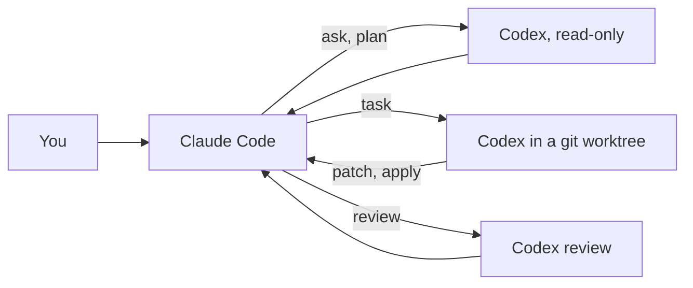

# Claudex

Pair Claude Code with the OpenAI Codex CLI. You drive from Claude Code. Claude decides when a second model earns its cost and engages Codex through five skills and one thin wrapper: Codex consults and plans read-only, implements in isolated git worktrees, and reviews diffs. Every Codex run keeps its full event log on disk and returns a compact report, so Claude's context stays small.



| Skill | Responsibility | Wrapper command |
| --- | --- | --- |
| [pair](skills/pair/SKILL.md) | The full loop and the engagement policy: plan duel, parallel split, integrate, cross-review | all |
| [codex-ask](skills/codex-ask/SKILL.md) | Read-only second opinion on a decision, bug, or unfamiliar API | `ask`, `reply` |
| [codex-plan](skills/codex-plan/SKILL.md) | Independent implementation plan as structured JSON, reconciled with Claude's | `plan` |
| [codex-task](skills/codex-task/SKILL.md) | Delegate a bounded implementation to an isolated worktree, then review and integrate the patch | `task`, `patch`, `apply`, `drop`, `reply` |
| [codex-review](skills/codex-review/SKILL.md) | Independent review of uncommitted changes, a branch, or a commit, then triage | `review` |

The [codex-liaison](agents/codex-liaison.md) agent runs a long Codex job end to end, verifies the result, and returns a short report, so the main conversation does not carry the transcript.

A `SessionStart` hook adds one paragraph of context each session: that Codex is available, where the wrapper is, and when to engage it. Claude tells you whenever it engages Codex and what Codex contributed. Invoke the loop explicitly with `/claudex:pair <task>`; the other skills are picked up by Claude when relevant, or invoked as `/claudex:codex-ask` and so on.

## How Codex runs

The wrapper `bin/codex-run` calls `codex exec --json` (and `codex review`) non-interactively. Model, reasoning effort, sandbox, and everything else inherit from `~/.codex/config.toml`; approval policy is forced to `never` because nobody is there to answer a prompt. Per call, `--model`, `--effort`, `--sandbox`, and raw `-c key=value` overrides are available, and `CLAUDEX_MODEL` and `CLAUDEX_EFFORT` set defaults.

Read-only modes (`ask`, `plan`) tell Codex not to change files. That is an instruction, not an enforced sandbox, unless you pass `--sandbox read-only` or set a restrictive default in your Codex config.

`task` mode isolates Codex in a git worktree under `~/.cache/claudex/worktrees/<repo>-<hash>/<name>` on branch `claudex/<name>`, created from `HEAD` (or `--base`). The checkout's uncommitted changes are copied in as a baseline commit so Codex builds on current work; `--exclude-uncommitted` skips that. Codex is told to leave its changes uncommitted. `patch` prints the diff against the baseline, `apply` merges it into the checkout with `git apply --3way`, and `drop` removes the worktree and branch. `--no-worktree` runs Codex directly in the repository for the rare case where Claude is idle.

Runs live under `~/.cache/claudex/runs/<run-id>/` with `prompt.md`, `events.jsonl`, `stderr.log`, `last_message.md`, `meta.json`, and `report.md`. `codex-run runs` lists them, `codex-run show <run-id>` reprints a report or summarizes a run still in progress, and `codex-run doctor` checks the Codex install and login. Set `CLAUDEX_HOME` to move the store and `CLAUDEX_CODEX_BIN` to point at a specific binary. `--max-minutes N` (or `CLAUDEX_MAX_MINUTES`) kills a runaway run.

```text
codex-run ask    -C <repo> "<question>"           # read-only consultation
codex-run plan   -C <repo> "<task>"               # structured plan (schemas/plan.json)
codex-run task   -C <repo> --name <slug> "<brief>" # implement in a worktree
codex-run review -C <repo> [--base <branch> | --commit <sha>] [--focus "..."]
codex-run reply  <thread-id> "<follow-up>"        # continue any thread
codex-run patch|apply|drop <name> -C <repo>       # integrate a task worktree
codex-run runs | show <run-id> [--live] | worktrees | doctor
```

Pass `-` instead of the prompt to read it from stdin.

## Requirements

- Codex CLI 0.153 or newer on `PATH`, logged in with a ChatGPT account (`codex login`). The wrapper uses `codex exec`, `codex exec resume`, and `codex review`.
- Python 3.10 or newer and git.
- Each Codex call counts against the ChatGPT plan's limits and, at high reasoning effort, takes minutes. Claude runs task, plan, and review calls in the background and keeps working.

## Install

Inside Claude Code:

```text
/plugin marketplace add astrosteveo/claude-plugins
/plugin install claudex@astrosteveo-plugins
```

From a local checkout, register the checkout directory instead of the GitHub name. To try the plugin without installing it, start Claude Code with `claude --plugin-dir /path/to/claude-plugins/plugins/claudex`.

## Limits

- Codex is reached through its CLI, not Claude's subagent system, so it cannot ask the user questions mid-run. Briefs must be self-contained.
- `codex exec resume` does not accept a working directory; replies run in the directory recorded for the original run.
- Worktrees start without installed dependencies or ignored files. Put setup commands in the brief.
- This plugin does not use `codex mcp-server`, which Codex marks as deprecated, nor the experimental app-server protocol.
