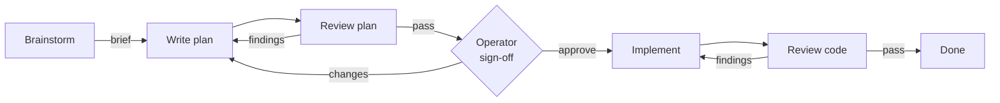

# Workflow

A small software team for one request. An orchestrator routes the work through
discovery, planning, implementation, and review. Every plan and every change
gets an independent review before it moves on, the way it would on a real team.



Start with `/workflow:orchestrate <request>`. It picks the entry stage from the
request and stops where you asked it to: "plan this" stops at the reviewed
plan, "review this branch" stops at findings, "build this" runs the whole loop.
A request with no clear goal starts in brainstorming. A one-line settled fix
skips straight to implementation, but it still gets reviewed.

| Skill | What it does | Runs as |
| --- | --- | --- |
| [orchestrate](skills/orchestrate/SKILL.md) | Routes stages, runs the sign-off gate, drives correction loops, keeps you informed | Main conversation |
| [brainstorm](skills/brainstorm/SKILL.md) | Turns "I don't know what I want yet" into a discovery brief through conversation | Main conversation |
| [writing-plans](skills/writing-plans/SKILL.md) | Writes a self-contained implementation plan from a brief or settled requirements | `workflow:planner` |
| [implement](skills/implement/SKILL.md) | Executes a plan, validates the behavior, reports with evidence | `workflow:implementer` |
| [review](skills/review/SKILL.md) | Reviews a plan or a change set against requirements and the real code; returns findings and a verdict | `workflow:reviewer` |

## How a request moves

1. **Discovery** happens in the main conversation because it is a dialogue
   with you; subagents cannot talk to you. The orchestrator runs the
   brainstorm skill itself. It ends with a saved brief.
2. **Planning** is delegated to the planner, which writes and saves the plan.
   The reviewer then reviews the plan against the brief and the codebase.
   Findings go back to the planner until the review passes.
3. **Sign-off.** The orchestrator shows you the plan path, a short summary,
   and the review outcome, and waits for you to approve, request changes, or
   stop. Say "don't stop for approval" in the original request to waive this.
4. **Implementation** is delegated to the implementer, then the reviewer
   reviews the changes. Findings go back to the implementer; the reviewer
   rechecks the corrections.
5. **Done.** The orchestrator reports what was delivered, what validation ran,
   and what the reviewer covered.

Correction loops run while they make progress. The orchestrator comes back to
you when a finding needs a product decision, when a finding recurs unchanged,
or when the next step needs something it does not have.

Nothing forces a new session between stages. If you stop, the orchestrator
gives you a resume command; a plan's status block records whether it has been
reviewed and approved, so `/workflow:orchestrate Plan: <path>` picks up in the
right place.

## Install

```text
/plugin marketplace add astrosteveo/claude-plugins
/plugin install workflow@astrosteveo-plugins
```

From a local checkout, register the checkout directory instead of the GitHub
name. To try it without installing, start Claude Code with
`claude --plugin-dir /path/to/claude-plugins/plugins/workflow`.

Restart Claude Code or run `/reload-plugins`.

## Usage

```text
/workflow:orchestrate Add rate limiting to the public API.
/workflow:orchestrate I want to do something with the analytics data but I'm not sure what.
/workflow:orchestrate Plan this, don't implement: migrate sessions from Redis to Postgres.
/workflow:orchestrate Review the changes on this branch.
/workflow:orchestrate Plan: /abs/path/docs/plans/003-rate-limiting.md
```

You can also enter a stage directly: `/workflow:brainstorm`,
`/workflow:writing-plans`, `/workflow:implement`, `/workflow:review`. A stage
run directly does its own job and stops; it does not arrange the reviews the
orchestrator would. A plan written directly is unreviewed until you hand it to
the orchestrator.

## Agents

The plugin registers three subagents: `workflow:planner`,
`workflow:implementer`, and `workflow:reviewer`. Each preloads its stage skill
through the `skills` frontmatter, so the procedure is in context from the
first turn. The reviewer is denied `Edit`, `Write`, and `NotebookEdit`; it
reads, runs existing checks, and reports. Model and permission settings inherit
from the parent session.

The planner exists only to run the writing-plans skill in an isolated context;
the orchestrator and reviewer treat the skill as the thing that matters. The
implementer and reviewer are the roles you would recognize from a team.

If the plugin's agents are not available in a session, the orchestrator reads
the bundled definition and hands it to a general-purpose subagent. If no
subagents are available, it says so and labels any review as self-review, which
does not satisfy the independent-review requirement.

## Artifacts

Artifacts belong to the project being worked on, following its conventions if
it has any. Otherwise briefs go to `docs/briefs/NNN-slug.md` and plans to
`docs/plans/NNN-slug.md`, numbered across each directory from `001`. A trivial
fix gets neither.

## Contents

```text
.claude-plugin/plugin.json
skills/{orchestrate,brainstorm,writing-plans,implement,review}/SKILL.md
agents/{planner,implementer,reviewer}.md
```

## References

- [Claude Code plugins](https://code.claude.com/docs/en/plugins)
- [Skills](https://code.claude.com/docs/en/skills)
- [Subagents](https://code.claude.com/docs/en/sub-agents)
